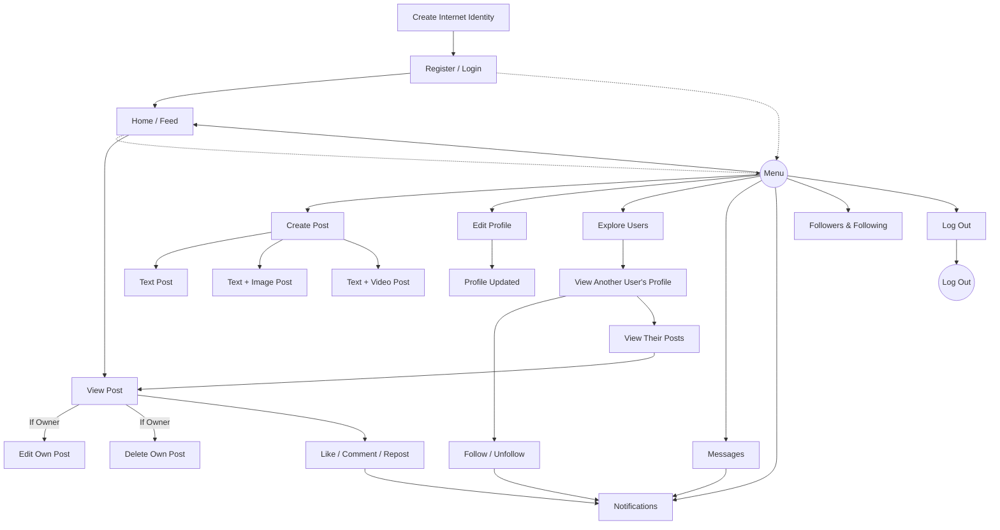

# 🌐 DeSocial 🧑‍💻  
*A Decentralized Social Media Platform on ICP*  

DeSocial is a decentralized social media platform built on the **Internet Computer Protocol (ICP)**. Unlike traditional social media platforms, DeSocial gives users **full ownership** of their identity, data, and content. It is censorship-resistant, scalable, and provides a real-time social experience.  

This repository contains the full-stack dApp setup using:  
- **Rust** canisters (backend)  
- **React.js** (frontend)  
- **Candid** (IDL interface)  

Our goal: **To build the future of open networking** 🚀  

---

## 🎯 Vision

DeSocial envisions a decentralized, censorship‑resistant social network where users truly own identity, data, and content—building a trustless, transparent, user‑first future for networking.

---

## ❌ The Problem With Traditional Social Media

Traditional social media platforms are **centralized** and come with several issues:

- 📊 Platforms control **data, reach, and monetization**.  
- ⚠️ They create **single points of failure** and bring higher **censorship risks**.  
- 🔒 Algorithms are **opaque** and lead to **vendor lock-in**.  
- ❌ Users lack **cryptographic ownership** of their identity and content.  

---

## ✅ Our Solution (DeSocial on ICP)

DeSocial solves these problems using the **Internet Computer Protocol (ICP):**

- 🔑 **Self-sovereign Identity** → Users fully own and control their profiles.  
- 🗂️ **User-owned Content** → Posts stored on ICP canisters, secure & immutable.  
- 🌐 **Decentralized Social Graph** → Follow/unfollow without central authority.  
- 🧩 **Composable APIs** → Open APIs for developers to build new clients & features.  
- ⚡ **Real-time Interactions** → Instant updates for likes, comments, reposts, and messages.  
- 🛡️ **Trustless Infrastructure** → No single point of failure, built on Rust + ICP.  

---

## ✨ Key Features of DeSocial

- ✅ **Self-sovereign Identity** – Users fully own and manage their profiles.  
- ✅ **User-owned Content** – Posts are stored on ICP canisters, ensuring ownership and immutability.  
- ✅ **Create / Edit / Delete Posts** – Users can manage **their own** posts (text / text+image / text+video).  
- ✅ **Social Interactions** – Like, comment, and repost any post.  
- ✅ **Follow/Unfollow System** – Build decentralized connections with no central authority.  
- ✅ **Real-time Messaging** – Peer-to-peer chat powered by ICP.  
- ✅ **Notifications** – Instant updates for likes, comments, reposts, follows, and messages.  
- ✅ **Profile Management** – Create, edit, and view user profiles.  
- ✅ **View Other Profiles** – Check posts, followers, and following of any user.  
- ✅ **Sharded Canisters** – Ensures scalability and reliability under load.  
- ✅ **On-chain Data Ownership** – All data stored securely on ICP, with **no single point of failure**.  

---

## 🧱 Tech Stack

- **Frontend**: React.js (for UI + real-time updates)
- **Backend**: Rust canisters using `ic-cdk`
- **IDL/Interface**: Candid
- **Dev Tooling**: `dfx`, `npm`, `cargo`
- **Deployment**: Local replica or ICP mainnet

---

## 🏗️ Project Flow



---

## 🎥 Project Demo  

▶️ **Demo Video:**  
[](https://youtu.be/tky2N0JVKPs)  

---

🚀 **Live Experience:**  
[](https://qcein-jaaaa-aaaad-qhoxa-cai.icp0.io/)

---

🌐 **Project Website**  
[](https://parimal-art.github.io/DeSocial-Page/)  

---


## 🚀 Getting Started (Local Development)

### 1️⃣ Install DFX SDK

```bash
sh -ci "$(curl -fsSL https://smartcontracts.org/install.sh)"
dfx --version
```

### 2️⃣ Start Local Replica

```bash
dfx start --background
```
This boots the Internet Computer locally.  

### 3️⃣ Deploy Canisters

```bash
dfx deploy
```
- Compiles Rust backend canisters
- Generates Candid interface files
- Deploys frontend + backend to local replica

App will be available at:  
```
http://localhost:4943?canisterId=<asset_canister_id>
```

### 4️⃣ Regenerate Candid Bindings (Optional)

If backend Rust canister changes:  
```bash
npm run generate
```
This regenerates frontend actor bindings from Candid files.  

### 5️⃣ Start Frontend (React Dev Server)

```bash
npm start
```
Frontend runs at:  
```
http://localhost:8080
```
(API requests are proxied to port `4943`).  

---

## 📁 Directory Structure

```
de_social/
├── src/
│   ├── de_social_backend/      # Rust canister logic
│   └── de_social_frontend/     # React app with agent bindings
├── dfx.json                    # Canister + network config
├── package.json                # Frontend + generate scripts
└── README.md                   # You're here
```

---

## 🌐 Production Notes

When deploying to **ICP mainnet**, disable root key fetching. Options:  

1. Set environment variable:  
   ```bash
   export DFX_NETWORK=ic
   ```  

2. Use `env_override` in `dfx.json`:  
   ```json
   "canisters": {
     "de_social_backend": {
       "declarations": {
         "env_override": "ic"
       }
     }
   }
   ```

3. Write a custom `createActor()` function with hardcoded host/network.  

---

## 🧪 Useful Commands

```bash
dfx start --background     # Start local replica
dfx deploy                 # Deploy canisters
npm start                  # Start frontend dev server
npm run generate           # Generate bindings from Candid
dfx stop                   # Stop local replica
```

---

## 📚 Developer References

- [ICP Quick Start](https://internetcomputer.org/docs/current/developer-docs/setup/deploy-locally)  
- [Rust Canister Guide](https://internetcomputer.org/docs/current/developer-docs/backend/rust/)  
- [Candid Syntax](https://internetcomputer.org/docs/current/developer-docs/backend/candid/)  
- [ic-cdk (Rust SDK)](https://docs.rs/ic-cdk)  
- [ic-cdk-macros](https://docs.rs/ic-cdk-macros)  

---

## 🤝 Contributions

We welcome contributions!  

1. Fork the repo  
2. Create a new feature branch  
3. Make and test changes locally  
4. Open a Pull Request 🚀  

---

## 📌 Current Status

- ✅ Login + Profile Management  
- ✅ Edit Profile  
- ✅ Create / Edit / Delete Posts  
- ✅ Like / Comment / Repost  
- ✅ Feed System  
- ✅ Follow / Unfollow  
- ✅ View Other Profiles  
- ✅ Notifications  
- ✅ Real-time Messaging  
- ✅ Sharded Canisters for scalability  

---

## 🔮 Future Enhancements

- 🌟 Tokenized rewards for creators (Web3 monetization)  
- 🌟 Group chats & communities  
- 🌟 End-to-end encryption for private messaging  
- 🌟 Mobile app integration  
- 🌟 Advanced analytics for content creators  

---

## ⚠️ Remaining Challenges

Even though DeSocial solves the issues of centralized platforms, being fully decentralized also brings new challenges:

- 🚫 Content Misuse → Users may upload nudity, hate speech, or illegal content.

- 🤖 Spam & Bots → Without central moderation, fake accounts or spam could flood the network.

- 💰 Scalability Costs → Storing heavy media (images, videos) directly on-chain can be expensive.

- 🧑‍🤝‍🧑 User Safety → Messaging and interactions could be misused for harassment if not moderated properly.

- ⚖️ Moderation vs Freedom Dilemma → Striking a balance between free speech and responsible use is difficult.

## 🛠️ Proposed Solutions

- 🗳️ Community Governance (DAO-based moderation) → Instead of a single authority, users can vote/flag harmful content.

- 🏷️ Content Labeling → Mark sensitive/NSFW content rather than removing it, giving users the choice to view or block.

- ⭐ Reputation & Token Economics → Bad actors lose reputation/tokens; good actors earn rewards for positive contributions.
 
- 🛡️ User Tools → Strong block/report system, customizable filters, and privacy settings for safety.

- 📂 Hybrid Storage → Use ICP canisters for metadata + decentralized storage like IPFS/Arweave for large media, with community-driven filters.

- 🧩 Filter Subscriptions → Users/communities can subscribe to moderation lists (family-friendly, strict, or free-speech).

## 🙌 Author’s Note

DeSocial is in **active development**. Our mission is to create a **truly decentralized, censorship-free, and user-first social media platform**.  

If you are exploring decentralized apps, ICP, or blockchain-powered networking, feel free to fork, extend, or raise issues.  

Together, let’s build the **future of social media** 🌍🚀
